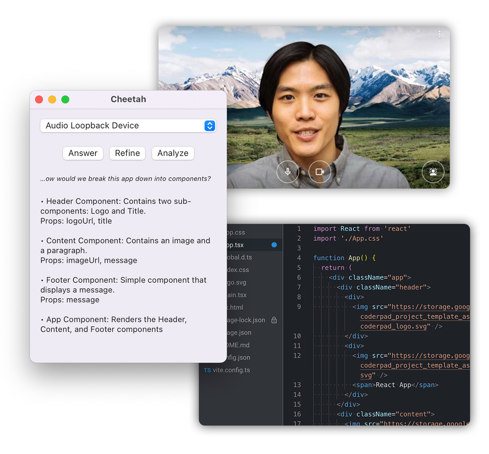

# Cheetah

Cheetah is an AI-powered macOS app designed to assist users during remote software engineering interviews by providing real-time, discreet coaching and live coding platform integration.

With Cheetah, you can improve your interview performance and increase your chances of landing that $300k SWE job, without spending your weekends cramming leetcode challenges and memorizing algorithms you'll never use.

## How it works

Cheetah leverages Whisper for real-time audio transcription and GPT-4 for generating hints and solutions. You need to have your own OpenAI API key to use the app. If you don't have access to GPT-4, gpt-3.5-turbo can be used as an alternative.

Whisper runs locally on your system, utilizing Georgi Gerganov's [whisper.cpp](https://github.com/ggerganov/whisper.cpp). A recent M1 or M2 Mac is required for optimal performance.

## Getting started

### Audio driver setup

For the best results, ensure the audio input captures both sides of the conversation.

When using a video chat app like Zoom or Google Meet, you can achieve this with [BlackHole](https://existential.audio/blackhole/), a free audio loopback driver. Follow the instructions for setting up a [Multi-Output Device](https://github.com/ExistentialAudio/BlackHole/wiki/Multi-Output-Device), and remember not to use the loopback device as input for the video chat app.

### App overview

Open the app and select an audio input to start live transcription. A snippet of the transcription will be displayed under the audio input selector.

*Note:* running the app in debug mode will result in very slow audio transcription performance.

The UI features three buttons:

**Answer:** Generates an answer for the interviewer's question.

**Refine:** Updates the existing answer, useful for when the interviewer provides additional constraints or clarification.

**Analyze:** Analyzes code and logs from the live coding environment in your web browser. Requires the browser extension.

You can also select (highlight) a portion of a generated answer and click Refine to get more detail.

### Installing the browser extension

Currently, only Firefox is supported. Follow these steps to install the extension:

1. Go to [about:debugging](https://firefox-source-docs.mozilla.org/devtools-user/about_colon_debugging/index.html)
2. Click "This Firefox"
3. Click "Load Temporary Add-on"
4. Select `./extension/manifest.json`

## Disclaimer

Cheetah is a satirical art project and is not intended for use in real-world settings. It may generate incorrect or inappropriate solutions. Users should exercise caution and take responsibility for the information provided by the app.
